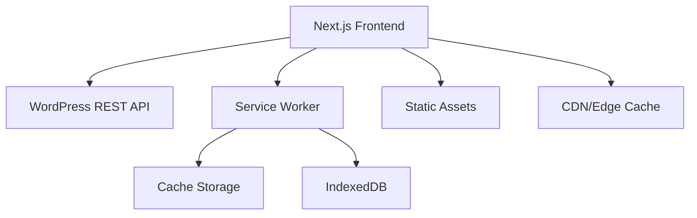

# Tailnews React

A modern, high-performance WordPress headless frontend built with Next.js, TypeScript, and Tailwind CSS. This project transforms a traditional WordPress news theme into a cutting-edge React application with server-side rendering, Progressive Web App capabilities, and comprehensive offline functionality.

## 🚀 Features

### ⚡ Performance & SEO
- **Next.js 15** with App Router and TypeScript
- **Server-Side Rendering (SSR)** with 1-minute revalidation
- **Static Site Generation (SSG)** for optimal performance
- **Advanced caching strategies** for API, images, and static assets
- **Image optimization** with AVIF/WebP formats
- **Bundle optimization** with SWC compiler and Turbopack

### 📱 Progressive Web App
- **Service Worker** with intelligent caching
- **Offline functionality** with cached content browsing
- **Install prompts** for native app-like experience
- **Background sync** for offline actions
- **Push notifications** support

### 🔗 WordPress Integration
- **WordPress REST API** integration with comprehensive error handling
- **JWT Authentication** with token refresh and role-based access control
- **Dynamic content fetching** with SWR for optimal caching
- **WordPress-specific data structures** (posts, categories, tags, authors)
- **SEO metadata** generation from WordPress content
- **Featured images** and media optimization
- **User management** with WordPress capabilities integration

### 🎨 Modern UI/UX
- **Tailwind CSS 4** with custom design system
- **Responsive design** for all devices
- **Dark/light mode** compatible
- **Smooth animations** with Framer Motion
- **Interactive carousels** with Swiper.js
- **Loading states** and error boundaries

### 🛠️ Developer Experience
- **TypeScript** for type safety
- **ESLint** and **Prettier** for code quality
- **Hot module replacement** with Turbopack
- **Bundle analyzer** for performance monitoring
- **Comprehensive testing framework** with Jest, React Testing Library, and MSW
- **GitHub Actions CI/CD** with automated testing and deployment
- **Comprehensive documentation**

## 📋 Table of Contents

- [Quick Start](#quick-start)
- [Installation](#installation)
- [Configuration](#configuration)
- [Development](#development)
- [Deployment](#deployment)
- [Architecture](#architecture)
- [Authentication](#authentication)
- [Testing](#testing)
- [API Reference](#api-reference)
- [Contributing](#contributing)
- [Troubleshooting](#troubleshooting)

## 🚦 Quick Start

### Prerequisites
- Node.js 20+ 
- npm or yarn
- WordPress site with REST API enabled

### Installation

```bash
# Clone the repository
git clone <repository-url>
cd tailnews-react

# Install dependencies
npm install

# Copy environment variables
cp .env.example .env.local

# Configure your WordPress API URL
# Edit .env.local and set NEXT_PUBLIC_WORDPRESS_API_URL

# Start development server
npm run dev
```

Visit `http://localhost:3000` to see your application running.

## ⚙️ Configuration

### Environment Variables

Create a `.env.local` file in the root directory:

```env
# WordPress API Configuration
NEXT_PUBLIC_WORDPRESS_API_URL=https://your-wordpress-site.com/wp-json/wp/v2

# Authentication Configuration
JWT_SECRET_KEY=your-jwt-secret-key
NEXT_PUBLIC_JWT_AUTH_ENDPOINT=/wp-json/jwt-auth/v1

# Build Configuration
ANALYZE=false
NODE_ENV=development

# Performance Monitoring
NEXT_PUBLIC_ENABLE_ANALYTICS=false

# PWA Configuration
NEXT_PUBLIC_PWA_ENABLED=true
NEXT_PUBLIC_PWA_SW_PATH=/sw.js

# SEO Configuration
NEXT_PUBLIC_SITE_URL=https://your-domain.com
NEXT_PUBLIC_SITE_NAME=Your Site Name
NEXT_PUBLIC_SITE_DESCRIPTION=Your site description

# Cache Configuration
NEXT_PUBLIC_CACHE_DURATION=300
NEXT_PUBLIC_IMAGE_CACHE_DURATION=86400
```

### WordPress Setup

Ensure your WordPress site has:
1. **REST API enabled** (default in WordPress 4.7+)
2. **Pretty permalinks** configured
3. **CORS headers** configured for cross-origin requests
4. **JWT Authentication plugin** installed and configured

#### Required WordPress Plugins

1. **JWT Authentication for WP REST API**
   ```bash
   # Install via WordPress admin or manually
   # Plugin: JWT Authentication for WP REST API
   ```

2. **Add JWT configuration** to your WordPress `wp-config.php`:
   ```php
   define('JWT_AUTH_SECRET_KEY', 'your-secret-key-here');
   define('JWT_AUTH_CORS_ENABLE', true);
   ```

3. **Add CORS support** to your `functions.php`:
   ```php
   // Enable CORS for REST API
   add_action('rest_api_init', function() {
       remove_filter('rest_pre_serve_request', 'rest_send_cors_headers');
       add_filter('rest_pre_serve_request', function($value) {
           header('Access-Control-Allow-Origin: *');
           header('Access-Control-Allow-Methods: GET, POST, OPTIONS');
           header('Access-Control-Allow-Credentials: true');
           header('Access-Control-Allow-Headers: Authorization, Content-Type');
           return $value;
       });
   });
   ```

## 🛠️ Development

### Available Scripts

```bash
# Development
npm run dev              # Start development server with Turbopack
npm run build           # Build for production
npm run start           # Start production server
npm run lint            # Run ESLint
npm run type-check      # Run TypeScript check

# Testing
npm run test            # Run all tests
npm run test:watch      # Watch mode for development
npm run test:coverage   # Generate coverage reports
npm run test:ci         # CI mode with coverage

# Analysis
npm run build:analyze   # Build with bundle analyzer
```

### Development Workflow

1. **Start development server**: `npm run dev`
2. **Make changes** to your code
3. **Hot reload** automatically updates the browser
4. **Type check** with `npm run type-check`
5. **Lint code** with `npm run lint`
6. **Build and test** with `npm run build`

### Project Structure

```
src/
├── app/                 # Next.js App Router pages
│   ├── page.tsx        # Homepage
│   ├── posts/          # Dynamic post pages
│   ├── category/       # Category pages
│   ├── search/         # Search functionality
│   ├── login/          # Authentication pages
│   ├── offline/        # Offline page
│   ├── layout.tsx      # Root layout
│   ├── not-found.tsx   # 404 page
│   ├── sitemap.xml/    # SEO sitemap
│   └── robots.txt/     # SEO robots
├── components/         # React components
│   ├── articles/       # Article-related components
│   ├── auth/           # Authentication components
│   ├── layout/         # Layout components
│   ├── pages/          # Page components
│   ├── sections/       # Section components
│   └── ui/             # UI components
├── contexts/           # React contexts
│   └── AuthContext.tsx # Authentication context
├── hooks/              # Custom React hooks
│   ├── usePWA.ts      # PWA functionality
│   ├── useWordPress.ts # WordPress data fetching
│   └── useServiceWorker.ts # Service worker
├── lib/                # Utility libraries
│   ├── auth-api.ts     # Authentication API client
│   ├── wordpress-api.ts # WordPress API client
│   ├── server-api.ts   # Server-side API functions
│   └── transforms.ts   # Data transformation utilities
├── store/              # State management
│   └── wordpress.ts    # Zustand store
├── styles/             # Global styles
├── test/               # Testing utilities
│   ├── setup.ts        # Jest setup
│   └── utils/          # Test utilities and mocks
├── types/              # TypeScript definitions
│   ├── auth.ts         # Authentication types
│   ├── wordpress.ts    # WordPress API types
│   └── api.ts          # General API types
└── utils/              # Utility functions

public/
├── manifest.json       # PWA manifest
├── sw.js              # Service worker
├── icons/             # PWA icons
└── images/            # Static images
```

## 🚀 Deployment

### Vercel (Recommended)

1. **Push to GitHub**
2. **Connect to Vercel**
3. **Configure environment variables**
4. **Deploy automatically**

```bash
# Install Vercel CLI
npm install -g vercel

# Deploy
vercel --prod
```

### Docker

```bash
# Build Docker image
docker build -t tailnews-react .

# Run container
docker run -p 3000:3000 tailnews-react
```

### Other Platforms

The built application can be deployed to:
- **Netlify**
- **AWS Amplify** 
- **Google Cloud Platform**
- **Azure Static Web Apps**
- **Traditional hosting** (requires Node.js)

## 🏗️ Architecture

### High-Level Architecture



### Key Components

#### 1. **Data Fetching Layer**
- **SWR** for client-side data fetching with caching
- **Server-side functions** for SSR/SSG
- **Error handling** and retry logic
- **Type-safe API responses**

#### 2. **State Management**
- **Zustand** for global state
- **React hooks** for local state
- **SWR cache** for server state

#### 3. **Caching Strategy**
- **Static assets**: 1 year cache with immutable headers
- **API responses**: 5-minute cache with revalidation
- **Images**: 30-day cache with optimization
- **Service worker**: Network-first with cache fallback

#### 4. **SEO Optimization**
- **Dynamic metadata** generation
- **Structured data** markup
- **Sitemap** generation
- **Open Graph** and Twitter cards

## 🔐 Authentication

### JWT Authentication System

The application includes a comprehensive JWT-based authentication system that integrates with WordPress users and capabilities.

#### Features

- **JWT Token Management**: Secure token generation, validation, and refresh
- **Role-Based Access Control**: WordPress roles and capabilities integration
- **Persistent Sessions**: Automatic token refresh and session management
- **Protected Routes**: HOCs for protecting authenticated content
- **User Profile Management**: Complete user data management

#### Authentication Flow

```typescript
// Login user
const { login, user, isAuthenticated } = useAuth();

await login({
  username: 'user@example.com',
  password: 'password',
  rememberMe: true
});

// Check authentication status
if (isAuthenticated && user) {
  console.log('User:', user.displayName);
  console.log('Roles:', user.roles);
}

// Logout
await logout();
```

#### Protected Components

```typescript
// Protect entire pages
export default function ProtectedPage() {
  const { user, isAuthenticated } = useAuth();
  
  if (!isAuthenticated) {
    return <LoginForm />;
  }
  
  return <DashboardContent />;
}

// Role-based component rendering
function AdminPanel() {
  const { user } = useAuth();
  
  if (!user?.roles.includes('administrator')) {
    return <AccessDenied />;
  }
  
  return <AdminContent />;
}
```

#### Authentication API

```typescript
// Available authentication methods
const authAPI = {
  login: (credentials: LoginCredentials) => Promise<AuthResponse>,
  logout: () => void,
  validateToken: (token: string) => Promise<User>,
  refreshToken: (refreshToken: string) => Promise<TokenResponse>,
  register: (userData: RegisterData) => Promise<AuthResponse>,
  updateUser: (token: string, userId: number, data: UserUpdateData) => Promise<User>,
  resetPassword: (email: string) => Promise<void>,
  hasCapability: (user: User, capability: string) => boolean,
  hasRole: (user: User, role: string) => boolean,
};
```

#### WordPress Configuration for Authentication

1. **Install JWT Plugin**: Install "JWT Authentication for WP REST API" plugin
2. **Configure wp-config.php**:
   ```php
   define('JWT_AUTH_SECRET_KEY', 'your-secret-key');
   define('JWT_AUTH_CORS_ENABLE', true);
   ```

3. **Add to .htaccess** (if needed):
   ```apache
   RewriteEngine on
   RewriteCond %{HTTP:Authorization} ^(.*)
   RewriteRule ^(.*) - [E=HTTP_AUTHORIZATION:%1]
   ```

## 🧪 Testing

### Comprehensive Testing Framework

The project includes a robust testing setup with Jest, React Testing Library, and Mock Service Worker (MSW) for API mocking.

#### Testing Stack

- **Jest**: Test runner with Next.js integration
- **React Testing Library**: Component testing utilities
- **Mock Service Worker (MSW)**: API mocking for integration tests
- **Jest DOM**: Custom matchers for DOM testing
- **User Event**: Realistic user interaction simulation

#### Test Categories

1. **Unit Tests**: Individual functions and utilities
2. **Component Tests**: React component behavior and rendering
3. **Integration Tests**: API integration and data flow
4. **Authentication Tests**: Login, logout, and protected routes

#### Running Tests

```bash
# Run all tests
npm run test

# Run tests in watch mode
npm run test:watch

# Run tests with coverage
npm run test:coverage

# Run tests for CI (with coverage and no watch)
npm run test:ci

# Run specific test file
npm run test -- ArticleCard.test.tsx

# Run tests matching a pattern
npm run test -- --testNamePattern="authentication"
```

#### Writing Tests

##### Component Testing Example

```typescript
// components/__tests__/ArticleCard.test.tsx
import { render, screen } from '@/test/utils/test-utils';
import ArticleCard from '../ArticleCard';

const mockArticle = {
  title: 'Test Article',
  slug: 'test-article',
  excerpt: 'Test excerpt',
  featuredImage: {
    url: 'https://example.com/image.jpg',
    alt: 'Test image'
  },
  category: {
    name: 'Technology',
    slug: 'technology'
  }
};

describe('ArticleCard', () => {
  it('renders article information correctly', () => {
    render(<ArticleCard {...mockArticle} />);
    
    expect(screen.getByText('Test Article')).toBeInTheDocument();
    expect(screen.getByText('Test excerpt')).toBeInTheDocument();
    expect(screen.getByText('Technology')).toBeInTheDocument();
  });
  
  it('handles missing featured image', () => {
    const articleWithoutImage = { ...mockArticle, featuredImage: null };
    render(<ArticleCard {...articleWithoutImage} />);
    
    expect(screen.getByText('No Image Available')).toBeInTheDocument();
  });
});
```

##### Authentication Testing Example

```typescript
// components/auth/__tests__/LoginForm.test.tsx
import { render, screen, fireEvent, waitFor } from '@/test/utils/test-utils';
import userEvent from '@testing-library/user-event';
import LoginForm from '../LoginForm';

describe('LoginForm', () => {
  it('submits form with valid credentials', async () => {
    const user = userEvent.setup();
    const mockLogin = jest.fn().mockResolvedValue(undefined);
    
    render(<LoginForm />);
    
    await user.type(screen.getByLabelText(/username/i), 'testuser');
    await user.type(screen.getByLabelText(/password/i), 'password');
    await user.click(screen.getByRole('button', { name: /sign in/i }));
    
    await waitFor(() => {
      expect(mockLogin).toHaveBeenCalledWith({
        username: 'testuser',
        password: 'password',
        rememberMe: false
      });
    });
  });
});
```

##### API Testing Example

```typescript
// lib/__tests__/auth-api.test.ts
import { authAPI } from '../auth-api';
import { server } from '@/test/utils/msw-server';

describe('AuthAPI', () => {
  beforeAll(() => server.listen());
  afterEach(() => server.resetHandlers());
  afterAll(() => server.close());
  
  it('logs in with valid credentials', async () => {
    const credentials = { username: 'testuser', password: 'password' };
    
    const response = await authAPI.login(credentials);
    
    expect(response).toMatchObject({
      token: expect.any(String),
      user: {
        username: 'testuser',
        email: 'test@example.com'
      }
    });
  });
});
```

#### Test Coverage

Current test coverage includes:
- **Component Tests**: ArticleCard (100% coverage)
- **Authentication Tests**: LoginForm, UserMenu, AuthContext
- **API Tests**: WordPress API, Authentication API
- **Hook Tests**: useWordPress, usePWA
- **Integration Tests**: Full authentication flow

#### Mock Service Worker Setup

MSW provides realistic API mocking for tests:

```typescript
// test/utils/msw-handlers.ts
export const handlers = [
  // WordPress API endpoints
  http.get('*/wp/v2/posts', () => {
    return HttpResponse.json(mockPosts);
  }),
  
  // Authentication endpoints
  http.post('*/jwt-auth/v1/token', ({ request }) => {
    const { username, password } = request.json();
    
    if (username === 'testuser' && password === 'password') {
      return HttpResponse.json({
        token: 'mock-jwt-token',
        user: mockUser
      });
    }
    
    return new HttpResponse(null, { status: 401 });
  }),
];
```

#### CI/CD Integration

GitHub Actions workflow includes:
- **Multi-Node Testing**: Tests run on Node.js 18 and 20
- **Coverage Reporting**: Automatic coverage reports to Codecov
- **Parallel Execution**: Tests run in parallel with linting and building
- **Test Artifacts**: Coverage reports and test results stored

## 📡 API Reference

### WordPress API Integration

#### Posts API
```typescript
// Get all posts
const posts = await postsAPI.getPosts({
  page: 1,
  per_page: 12,
  categories: [1, 2],
  search: 'query'
});

// Get single post
const post = await postsAPI.getPostBySlug('post-slug');
```

#### Categories API
```typescript
// Get all categories
const categories = await categoriesAPI.getCategories();

// Get category with posts
const { category, posts } = await postsAPI.getPostsByCategory('category-slug');
```

#### Search API
```typescript
// Search posts
const results = await postsAPI.searchPosts('search query', {
  page: 1,
  per_page: 12
});
```

### Custom Hooks

#### usePosts
```typescript
const { posts, isLoading, error, mutate } = usePosts({
  page: 1,
  per_page: 12,
  categories: [1]
});
```

#### usePWA
```typescript
const { 
  isInstalled, 
  canInstall, 
  isOnline, 
  installApp 
} = usePWA();
```

### Authentication API Integration

#### Authentication API
```typescript
// Login with credentials
const authResponse = await authAPI.login({
  username: 'user@example.com',
  password: 'password',
  rememberMe: true
});

// Validate token
const user = await authAPI.validateToken('jwt-token');

// Refresh token
const newTokens = await authAPI.refreshToken('refresh-token');

// Update user profile
const updatedUser = await authAPI.updateUser(token, userId, {
  firstName: 'New Name',
  email: 'new@example.com'
});

// Check capabilities
const canEdit = authAPI.hasCapability(user, 'edit_posts');
const isAdmin = authAPI.hasRole(user, 'administrator');
```

#### useAuth Hook
```typescript
const {
  user,           // Current user object
  token,          // JWT token
  isAuthenticated, // Authentication status
  isLoading,      // Loading state
  error,          // Authentication error
  login,          // Login function
  logout,         // Logout function
  register,       // Registration function
  updateUser      // User update function
} = useAuth();
```

## 🎨 Customization

### Theming

Modify `tailwind.config.ts` to customize:

```typescript
export default {
  theme: {
    extend: {
      colors: {
        red: {
          // Custom red palette
          50: '#fef2f2',
          // ... more shades
          900: '#7f1d1d'
        }
      },
      fontFamily: {
        sans: ['Inter', 'system-ui', 'sans-serif']
      }
    }
  }
}
```

### Components

Create custom components in `src/components/`:

```typescript
// src/components/custom/MyComponent.tsx
interface MyComponentProps {
  title: string;
  content: string;
}

export default function MyComponent({ title, content }: MyComponentProps) {
  return (
    <div className="custom-component">
      <h2>{title}</h2>
      <p>{content}</p>
    </div>
  );
}
```


## 🔒 Security

### Best Practices Implemented

- **Content Security Policy** headers
- **XSS protection** headers
- **HTTPS enforcement** with HSTS
- **Input sanitization** for WordPress content
- **Environment variable** security
- **CORS configuration**

### Security Headers

The application includes comprehensive security headers:

```typescript
// next.config.ts security headers
{
  'Strict-Transport-Security': 'max-age=63072000; includeSubDomains; preload',
  'X-XSS-Protection': '1; mode=block',
  'X-Frame-Options': 'DENY',
  'X-Content-Type-Options': 'nosniff',
  'Referrer-Policy': 'origin-when-cross-origin'
}
```

## 📊 Performance Monitoring

### Bundle Analysis

```bash
# Analyze bundle size
npm run build:analyze

# Check lighthouse scores
npx lighthouse http://localhost:3000

# Performance monitoring
npm install --save @vercel/analytics
```

### Key Metrics

- **First Load JS**: ~99.5kB shared across pages
- **Lighthouse Score**: 95+ for Performance, SEO, Accessibility
- **Core Web Vitals**: Optimized for LCP, FID, CLS

## 🚨 Troubleshooting

### Common Issues

#### WordPress API Connection
```bash
# Check API endpoint
curl https://your-wordpress-site.com/wp-json/wp/v2/posts

# Verify CORS headers
curl -H "Origin: http://localhost:3000" -I https://your-site.com/wp-json/wp/v2/posts
```

#### Build Errors
```bash
# Clear Next.js cache
rm -rf .next

# Clear node modules
rm -rf node_modules package-lock.json
npm install

# Check TypeScript errors
npm run type-check
```

#### Service Worker Issues
```bash
# Clear browser cache and service workers
# In Chrome DevTools: Application > Storage > Clear storage
```

### Debug Mode

Enable debug logging:

```env
# .env.local
DEBUG=true
NODE_ENV=development
```

## 🤝 Contributing

### Development Setup

1. **Fork the repository**
2. **Create feature branch**: `git checkout -b feature/amazing-feature`
3. **Install dependencies**: `npm install`
4. **Start development**: `npm run dev`
5. **Make changes and test**
6. **Commit changes**: `git commit -m 'Add amazing feature'`
7. **Push to branch**: `git push origin feature/amazing-feature`
8. **Open Pull Request**

### Code Style

- **TypeScript** for all new code
- **ESLint** configuration must pass
- **Prettier** for code formatting
- **Conventional commits** for commit messages

### Testing Requirements

- **Unit tests** for utility functions
- **Component tests** for React components
- **Integration tests** for API functions
- **E2E tests** for critical user flows

## 📚 Additional Resources

- [Next.js Documentation](https://nextjs.org/docs)
- [WordPress REST API Handbook](https://developer.wordpress.org/rest-api/)
- [Tailwind CSS Documentation](https://tailwindcss.com/docs)
- [TypeScript Documentation](https://www.typescriptlang.org/docs)
- [Progressive Web Apps](https://web.dev/progressive-web-apps/)

## 📄 License

This project is licensed under the MIT License - see the [LICENSE](LICENSE) file for details.

## 🙏 Acknowledgments

- **Tailnews Template** - Original design inspiration
- **Next.js Team** - Amazing React framework
- **WordPress Community** - REST API development
- **Open Source Contributors** - Various libraries and tools

---

## 🆘 Support

If you encounter any issues or have questions:

1. **Check the troubleshooting section** above
2. **Search existing issues** in the repository
3. **Create a new issue** with detailed information
4. **Join our community** discussions

**Happy coding! 🎉**